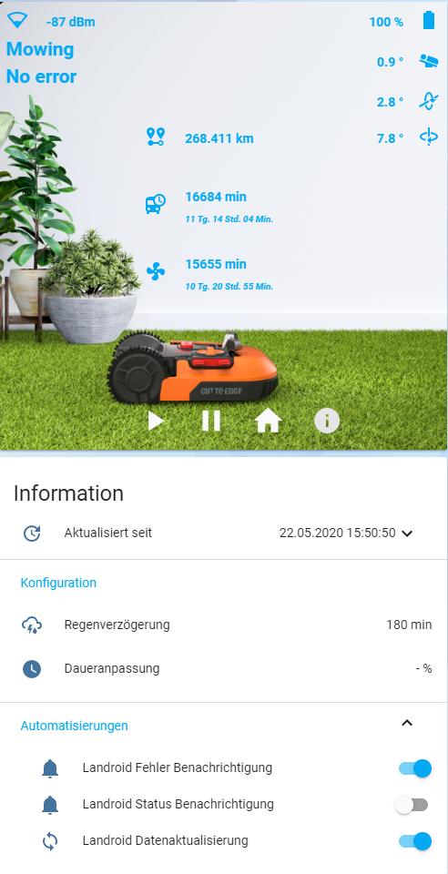

[](https://www.buymeacoffee.com/barma)

# Worx Landroid package for Home Assistant
Worx Landroid package for Home Assistant based on Landroid Cloud by @MTrab

[Discussion in Home Assistant community](https://community.home-assistant.io/t/worx-landroid-package/119345)



## Landroid Cloud installation
For the package to work, you need to install Landroid Cloud Integration: https://github.com/MTrab/landroid_cloud

## Home Assistant

It is minimum 2021.4 version of Home Assistant required

1. In configuration.yaml add string _packages: !include_dir_named packages_:
```yaml
homeassistant:
  packages: !include_dir_named packages
```

2. Edit your secrets.yaml.
```yaml
landroid_mail: YOUR_EMAIL_IN_MY_LANDROID
landroid_pass: YOUR_PASSWORD_IN_MY_LANDROID
landroid_ip: YOUR_LANDROID_IP_ADDRESS_IF_YOU_NEED_IT_OR_''
landroid_sn: LANDROID_SERIAL_NUMBER_IF_YOU_NEED_IT_OR_''
landroid_mac: LANDROID_MAC_ADDRESS_IF_YOU_NEED_IT_OR_''
```

3. Copy folders **www** and **packages** with all content in your homeassistant folder

4. If you need different as English language (Current is only in German) then add to folder **package** a file with your language from a folder *lang/landroid_LANGUAGE_CODE.yaml* e.g. [lang/landroid_de.yaml](lang/landroid_de.yaml).

5. Create a new manual card in Lovelace ([Here is manual](https://github.com/Barma-lej/halandroid/blob/master/help/add_card.md)) and add content from a file [lovelace/card.yaml](lovelace/card.yaml). If you need different as English language then add content from a file *lovelace/card_LANGUAGE_CODE.yaml* e.g. [lovelace/card_de.yaml](lovelace/card_de.yaml).

6. Change the name of lawnmower in App to **Mower**

OR

Search `sensor.landroid_mower_battery`, `sensor.landroid_mower_error`, `sensor.landroid_mower_status` in the files **package/landroid_de.yaml**, **package/landroid_LANGUAGE_CODE.yaml** and in **new Lovelace card** and replace it with your sensor names

7. If you use a Google Assistant, then use switch **landroid_mowing** in your Google Assistant integration:
```yaml
  switch.landroid_mowing:
    name: Mähroboter
    room: Garten
    expose: true
```
8. Check config and restart Home Assistant
#### NOTE: you will require the "fold-entity-row" plugin. This can be found using HACS or via the repository https://github.com/thomasloven/lovelace-fold-entity-row

#### _Enjoy_

#### _Удачи_:)

### If your lawnmower has been banned.
Services and app stopped working

* Go to [My Landroids](https://account.worxlandroid.com/product-items)
* Unlink your Landroid
* Open app on mobile device
* Add Landroid


<a href="https://www.buymeacoffee.com/barma" target="_blank"></a>
