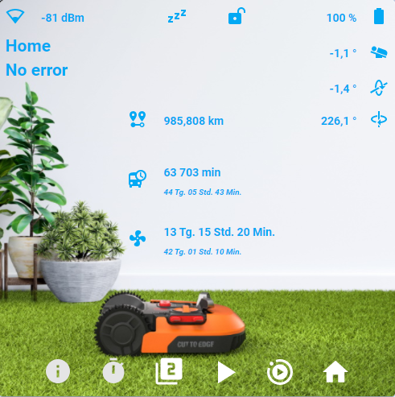
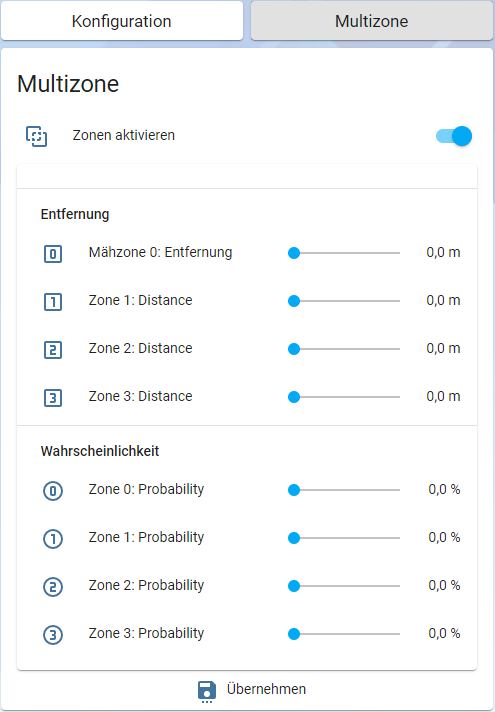
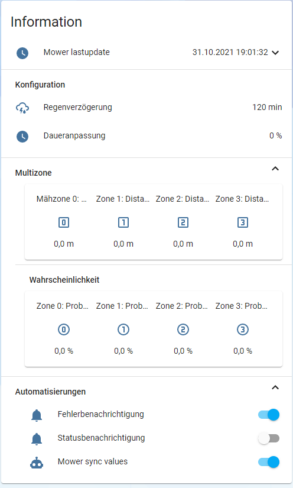

[](https://community.home-assistant.io/t/worx-landroid-package/119345)
[](https://www.buymeacoffee.com/barma)

# Worx Landroid package for Home Assistant
Worx Landroid package for Home Assistant based on [Landroid Cloud by @MTrab](https://github.com/MTrab/landroid_cloud)



## Requirements

1. **Home Assistant** version 2021.4 or above
2. **Landroid Cloud** Integration. Install [using HACS](https://github.com/hacs/integration) or [see this guide](https://github.com/MTrab/landroid_cloud#installation)
3. **fold-entity-row** plugin. Install [using HACS](https://github.com/hacs/integration) or [see this guide](https://github.com/thomasloven/lovelace-fold-entity-row#installing), it is possible you also need to install [**card-tools**](https://github.com/thomasloven/card-tools) add-on

## Installation
1. In configuration.yaml add string _packages: !include_dir_named packages_:
```yaml
homeassistant:
  packages: !include_dir_named packages
```

2. Edit your secrets.yaml.
```yaml
mower_mail: YOUR_EMAIL_IN_MY_LANDROID
mower_pass: YOUR_PASSWORD_IN_MY_LANDROID
mower_ip: YOUR_LANDROID_IP_ADDRESS_IF_YOU_NEED_IT_OR_''
```

3. Copy folders **www** and **packages** with all content in your homeassistant configuration folder (you can find configuration.yaml there)

4. Add to folder **package** a file with your language from a folder *lang/landroid_LANGUAGE_CODE.yaml* e.g. [lang/landroid_de.yaml](lang/landroid_de.yaml).

5. Create a new manual card in Lovelace ([Here is manual](https://github.com/Barma-lej/halandroid/blob/master/help/add_card.md)) and add content from a file [lovelace/card.yaml](lovelace/card.yaml). If you need different as English language then add content from a file *lovelace/card_LANGUAGE_CODE.yaml* e.g. [lovelace/card_de.yaml](lovelace/card_de.yaml).

6. Change the name of lawnmower in App to **Mower**

OR

Search for `mower` in the files **package/landroid_de.yaml**, **package/landroid_LANGUAGE_CODE.yaml** and in **new Lovelace card** and replace it with your lawnmower's name

7. **For LandXCape or Kress mower owners**

Uncomment the relevant line in the `landroid.yaml` file
```
landroid_cloud:
  email: !secret mower_mail
  password: !secret mower_pass
  #type: landxcape
  #type: kress
```

8. If you use a Google Assistant, then use switch **landroid_mowing** in your Google Assistant integration:
```yaml
  switch.landroid_mowing:
    name: Mähroboter
    room: Garten
    expose: true
```
8. Check config and restart Home Assistant

**_Enjoy_**

## mini FAQ

### How to setup multiple mowers?

1. Set different names of your mowers eg. *mower* and *mower2*
2. Make a copy of *landroid.yaml* as *landroid2.yaml* in the same folder (**packages**)
3. Rename all positions of *mower* to *mower2* in *landroid2.yaml*
4. In lovelace create a second card and rename all positions of *mower* to *mower2*

### If your lawnmower has been banned.
Services and app stopped working

* Go to [My Landroids](https://account.worxlandroid.com/product-items)
* Unlink your Landroid
* Open app on mobile device
* Add Landroid


<a href="https://www.buymeacoffee.com/barma" target="_blank"></a>
