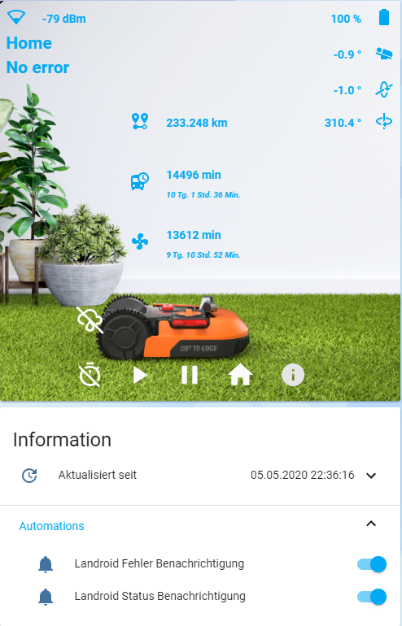

<a href="https://www.buymeacoffee.com/barma" target="_blank"></a>

# Worx Landroid package for Home Assistant
Worx Landroid package for Home Assistant based on Landroid Cloud by @MTrab



## Landroid Cloud installation
For the package to work, you need to install Landroid Cloud Integration: https://github.com/MTrab/landroid_cloud

## Home Assistant

1. Copy folders **www** and **packages** with all content in your homeassistant folder
2. In configuration.yaml add string _packages: !include_dir_named packages_:
```yaml
homeassistant:
  packages: !include_dir_named packages
```
3. Add to your Lovelace config content from file **add_to_lovelace.yaml** ([How? See here](/help/work_with_lovelace.md))
4. Change **YOUR_ID_HERE** with your *ID*, which you can see in *sensor.landroid_m500_status* attribute *id*, in lines 257, 265 and 273 in file **landroid.yaml** 
5. If you need, translate strings in files **landroid.yaml** section _customize_ and **add_to_lovelace.yaml** from German and Russian
6. If you use a Google Assistant, then use switch **landroid_mowing**:
```yaml
  switch.landroid_mowing:
    name: Mähroboter
    room: Garten
    expose: true
```
<a href="https://www.buymeacoffee.com/barma" target="_blank"></a>

#### _Enjoy_

#### _Удачи_:)
