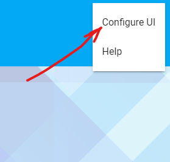
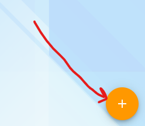
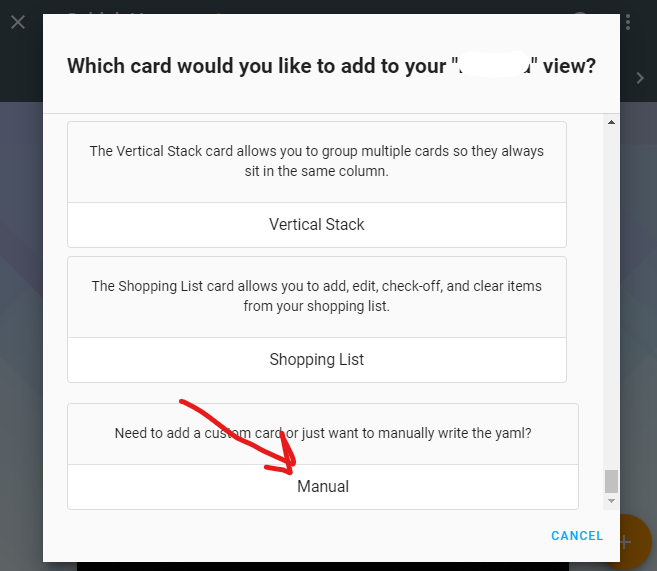
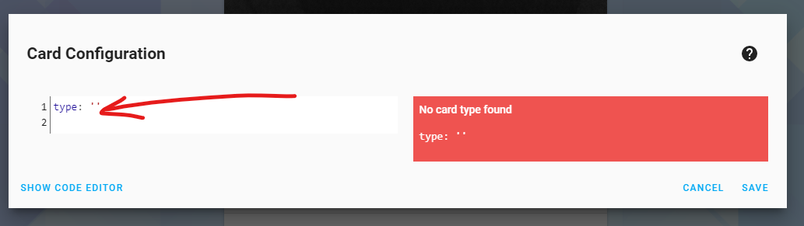
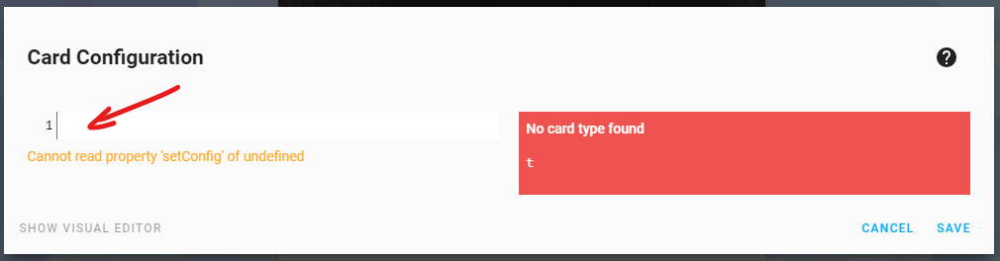
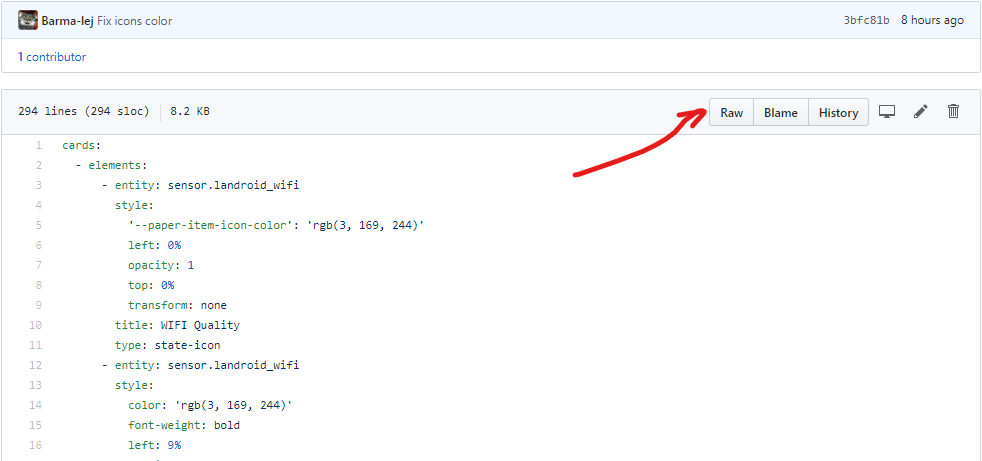
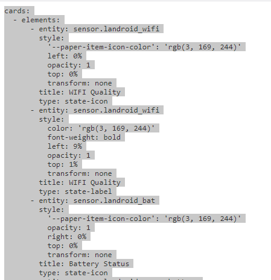
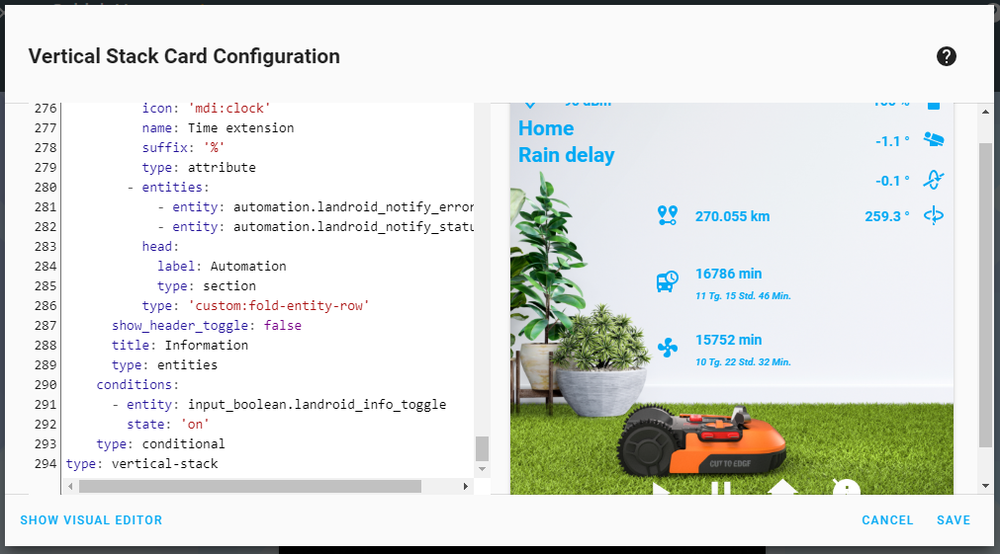

# How to add card into your Lovelace

1. Open your Home Assistant

2. Click on three dots menu in top right corner

3. Click on "Configure UI"

4. Click a + *Plus* button in the bottom right corner

5. search the *Manual* card (at the bottom) and click it

6. Delete all contents

7. Open file (lovelace/card.yaml)

8. Click on RAW

9. Select all and copy all

10. Paste content in the manual card

11. Click on "Save" button

12. That's all 
