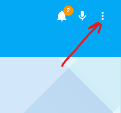
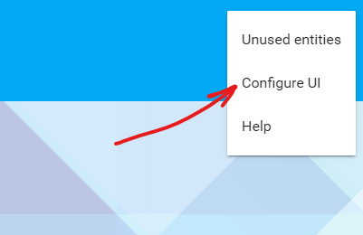
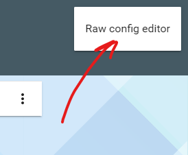
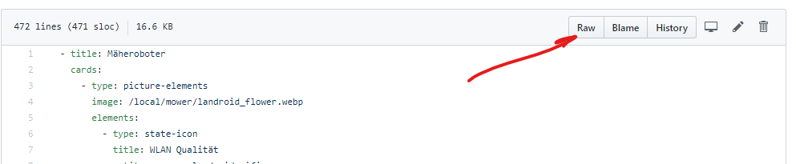
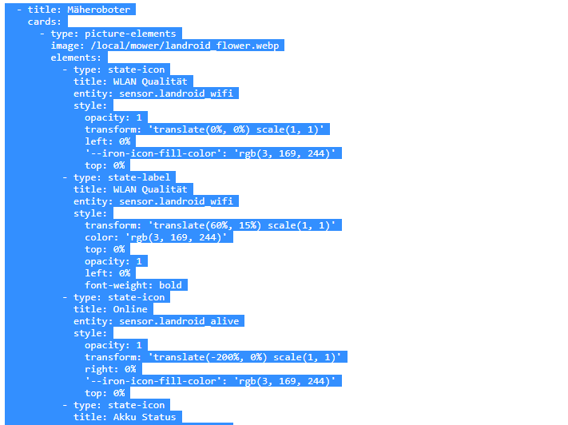
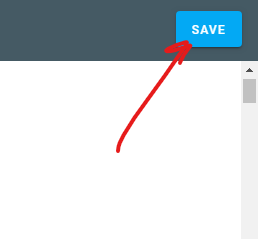

# How to insert contents of _add_to_lovelace.yaml_ into your Lovelace configuration

1. Open your Home Assistant

2. Click on three dots menu in top right corner

3. Click on "Configure UI"

4. Click again on three dots menu

5. Click on "Raw config editor"

6. !!! Save the content somewhere, e.g. create new temporary file and copy paste content of your config

7. Open file _add_to_lovelace.yaml_

8. Click on RAW

9. Select all and copy all

10. Paste content in the new line after key "views:" in your lovelace config

11. Click on "Save" button

12. Place the new view to the desired position

